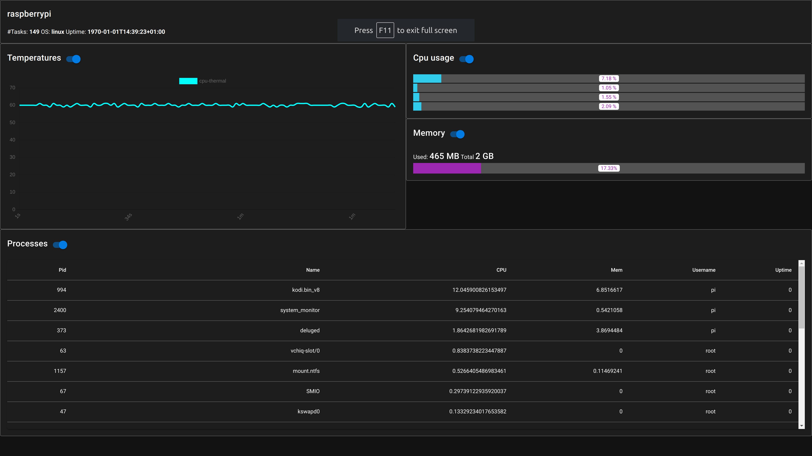

### Backend build
* env GOOS=linux GOARCH=arm GOARM=5 go build

### Frontend build
* npm run build

### Installation on RaspberryPi
* Build go binaries and built index.html(from web-ui/dist folder) on raspberyy pi
* Run "chmod +x system_monitor"
* Start go backend: ".\system_monitor"

### Screenshot
